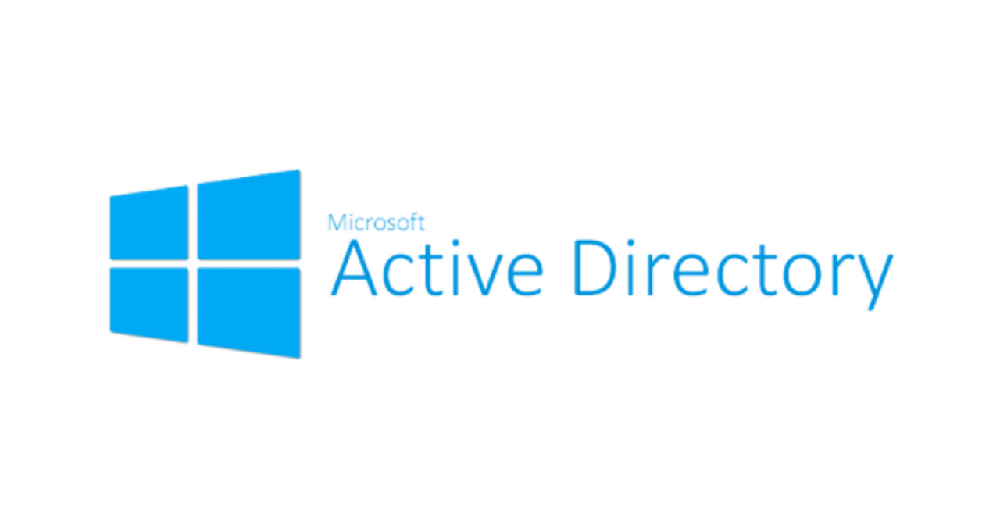

# 배우면서 정리하는 Active Directory 기초 개념 

약4년간 IT운영 생활을 끝내고 30살까지 약 2년남은 상황. 

인프라 운영을 담당 할 때 내 또래 엔지니어 분들이 부러웠다. 

무작정 IT운영을 접고 엔지니어로 전향하고 싶어 퇴사를 하고,  좋은 기회로 엔지니어로 전향을했다..

잡소리가 길었지만 기초개념이 중요하다고.. 앞으로 엔지니어 생활을 하면서 기초개념과, 정리 부분을 

적어야 겠다고 다짐했고 그 첫단계가 네이버 블로그에 일기장 같이 쓴 포스팅 글을 github로 바꾸면서

재대로된 기술블로그를 운영해보겠다고 앞으로 쭉 포스팅을 할 예정이다.

물론 나만볼꺼고..아직까지는 그 첫번째 포스팅이 운영할때도 사용하고 엔지니어로 전향하면서도 

계속 사용해야될 AD포스팅으로 시작을 할 거 같다. 

틀린 부분도 있을 수 있으니 참고해야될거같으며, 추 후 계속 업데이트 할 예정이당. 

## ActiveDirectory란

ActiveDirectory란 Microsoft Infra를 사용하기 위한 인증/허가(SSO) 및 디렉토리 서비스 집합체이며, 데이터 베이스 이다.

주된 사용목적은 "중앙관리","SSO","데이터베이스" 로 나뉠 수 있다.

또한 AD는 Object(객체)와 attributes(속성)로 이루어져있으며,

객채란 사전적인 정의란 "무언가 이루고 있는 가장 작은 범위" 이다.

Active directroy는 데이터 베이스라고 했다 이는 쿼리 질의가 가능한대 AD는 기본적으로 LDAP(389)를 사용하며, 

쿼리가 가능하기 때문에 타사 디렉토리나 오픈 소스 연동으로 인한 데이터공유가 하며,

데이터 베이스는 MS Access기반이고 NTDS폴더 안의 ntds.dit 파일형태로 저장되어있다.

### ActiveDirectory 용어 개념 

1. DS(Domain Service)
   - 
2. DC(Domain Controller)
   - Active Directory DS 서비스 구동을 담당하는 서비스가 DC이다. DC의 파티션은 3가지로 나눠지는대  Schema,Configuration,Domain,(app)으로 이루어 져있다.  MS에서는 2개의 DC를 권장한다. 
3. Domain
   - 도매인이란 DC가 영향을 미치는 범위이며, AD의 가장 기본적인 단위이다. 도매인은 Parents Domain 과 Child Domain으로 나뉠 수 있으며, 논리적으로 하나로 묶을 수도 있다. 논리적 개념이다.
4. Container
   - 
5. OU(Organizationaul Units)
   - 
6. Object 
   - 객채란 무언가 이루는 가장 단위라고 칭하며, AD에서는 사용자, 컴퓨터, OU 등을 칭한다. 
7. Attributes 
   - 
8. Schema
   -  
9. Tree
   - Domain 계층적인 구조로 연결되어있을 때 Tree 라고 부른다 논리적인 개념이다. 이 때 도매인 끼리는 공통된 Schema, Configuration, Global catalog 를 사용 한다. 
10. Forests
    - 2개 이상의 트리를 이루어진 AD를 칭한다 Tree의 기술적인 용어가 Forest 이다.  이 때 트러스트가 형성되는대 기본적으로 양방향 전이 트러스트를 갖게 된다. 
11. Global Catalog
    - 
12. site 
    - 

## ActiveDirectory Group

 1. domain local group

    - 

 2. Global Group

    -  

 3. Universal Group

    - 

  MS에서 권장하는 방식은 AGDLP

  Account-Global-DomainLocal-Permission 

## DNS

## 운영팁

### Short Command
1. wf.msc : 윈도우고급방화벽

2. servermanager : 서버관리자

3. dnsmgmt.msc : DNS관리자 

4. rsop.msc : 정책결과집합(AD)

5. dsa.msc : 사용자 및 컴퓨터관리(AD)

6. gpmc.msc : 그룹정책 관리자(AD)

7. dsssite.msc : 사이트 서비스(AD) 

8. domain.msc : 도매인트러스트(AD) 

 

### Power Shell 

---

객체생성 (현재 도매인은 DC.COM 이다.)  

----

1. OU 생성 

   - Set-ADObject -Identity:"OU=NEW_AD,DC=dc,DC=com" -ProtectedFromAccidentalDeletion:$true -Server:"AD01.dc.com"

     Set-ADObject -Identity:"OU=NEW_OU,DC=dc,DC=com" -ProtectedFromAccidentalDeletion:$true -Server:"AD01.dc.com"

---

운영

---

1. 특정 사용자 정보 조회 
   * Get-ADUser [UserID]
2. 모든 사용자 정보 조회
   * Get-ADUser -filter *  
3. 모든 사용자 정보 조회 ( 세부사항 )
   * GET-ADuser -filter * -properties
4. 모든 사용자 정보와 사용자 계정 조회
   * Get-aduser -filter * -properties * | select name,samacountname 

5. 비활성화된 정보와 그 계정 조회 

   * search-adaccount -accountdisabled | select name, SamAccountname 

6.  잠김 계정 출력 

   * search-adaccount -lockedout | select name, samaccountname 

7.  get-aduser 옵션 값 

   1)  whenChanged : 계정변화된 시  
   2)  whenCreated : 생성 일자 
   3)  UserPrincipalName : 사용자 계정 이름
   4)  PasswordLastset : 패스워드 바뀐 일자
   5)  LastLogon : 마지막 로그인 일자
   6)  MemberOF : OU 위치 
   7)  DistinguishedName : 고유값

   

8. 

