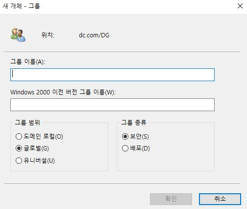
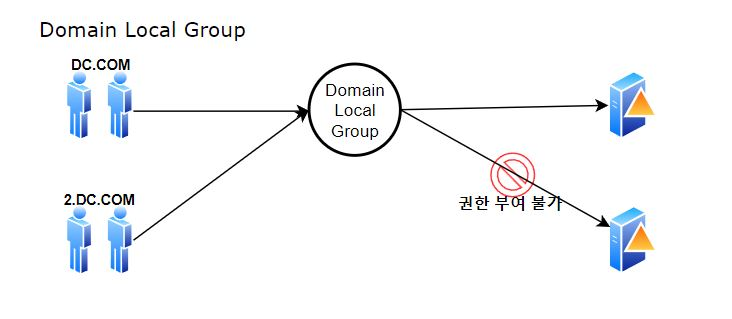
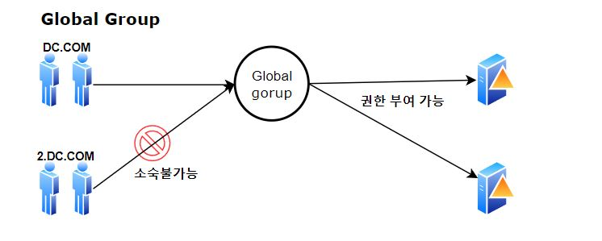
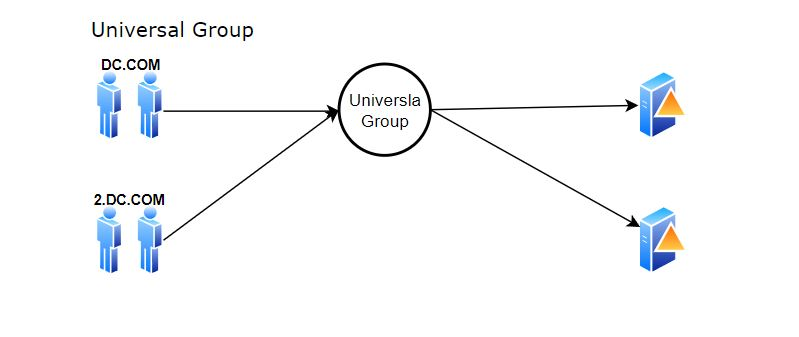
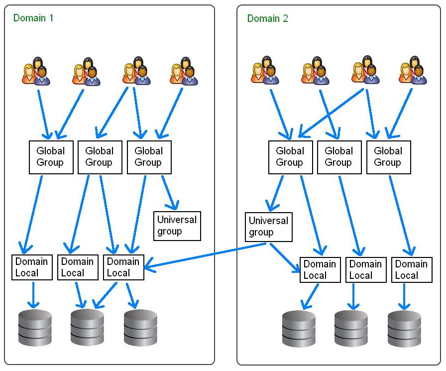

# 배우면서 정리하는 Active Directory 기초 개념 

## ActiveDirectory란


ActiveDirectory란 Microsoft Infra를 사용하기 위한 인증/허가(SSO) 및 디렉토리 서비스 집합체이며, 데이터 베이스 이다.

주된 사용목적은 "중앙관리","SSO","데이터베이스" 로 나뉠 수 있다. 또한 AD는 Object(객체)와 attributes(속성)로 이루어져있으며,객채란 사전적인 정의란 "무언가 이루고 있는 가장 작은 범위" 이다. 

Active directroy는 데이터 베이스라고 했다. 이는 쿼리 질의가 가능한대 AD는 기본적으로 LDAP(389)를 사용하며,  쿼리가 가능하기 때문에 타사 디렉토리나 오픈 소스 연동으로 인한 데이터공유가 하며데이터 베이스는 MS Access기반이고 NTDS폴더 안의 ntds.dit 파일형태로 저장되어있다.

* ActiveDirectory는 크게 SSO인증 데이터베이스 관리용도로 사용한다
* ActiveDirectory는 Object 로 이루어져있으며 이 Object는 Attributes 로 구성되어있다
* ActiveDirectroy 인증방식은 Kerberos 프로토콜을 사용한다.   


### ActiveDirectory 용어 개념 

1. DS(Domain Service)
   - Active Directory Domain Service 실현하기 위한 MS의 LDAP Directory 서비스 이며. 여러 정보 및 객체를 네트워크를 통해 중앙에서 통합하여 관리하는 서비스이다.  
2. DC(Domain Controller)
   - Active Directory DS 서비스 구동을 담당하는 서비스가 DC이다. DC의 파티션은 3가지로 나눠지는대  Schema,Configuration,Domain,(app)으로 이루어 져있다.  MS에서는 2개의 DC를 권장한다. 
3. Domain
   - 도매인이란 DC가 영향을 미치는 범위이며, AD의 가장 기본적인 단위이다. 도매인은 Parents Domain 과 Child Domain으로 나뉠 수 있으며, 논리적으로 하나로 묶을 수도 있다. 논리적 개념이다.
4. Container
   - 
5. OU(Organizationaul Units)
   - 제어위임과 GPO정책을 적용할 수 있는 최소 단위이며, 도매인 안에서 관리 편리성을 위해 세부적인 단위로 나뉜것을 말한다. 
6. Object 
   - 객채란 무언가 이루는 가장 단위라고 칭하며, AD에서는 사용자, 컴퓨터, OU 등을 칭한다. 
7. Attributes 
   - 
8. Schema
   -  
9. Tree
   - Domain 계층적인 구조로 연결되어있을 때 Tree 라고 부른다 논리적인 개념이다. 이 때 도매인 끼리는 공통된 Schema, Configuration, Global catalog 를 사용 한다.  계층적인 성향을 가진다. Parents Domain 이 DC.COM이라면 PC.DC.COM의 형태로 구성된다. 
10. Forests
    - 2개 이상의 트리를 이루어진 AD를 칭한다 Tree의 기술적인 용어가 Forest 이다.  이 때 트러스트가 형성되는대 기본적으로 양방향 전이 트러스트를 갖게 되며, Object, attribute, Schema의 속성값이 같다. 같은 스키마를 사용하고 있는 전범위이다. DC마다 인증기관은 달라도 스카마 뼈대의값이 동일하다. 인증 범위는 분리되어있다. 
11. Global Catalog
    - 트러스트내 도매인에 포함된 Objcet 에 대한 정보를 수집하여 저장하는곳을 말한다. 트래픽 문제 때문에 Object 일부분만 저장하고 복제한다. 
12. site 
    - 물리적인 시각으로 봐야된다. 실제 네트워크상 떨어져있는곳, 물리적으로 떨어져있는곳을 site라 한다. 


## ActiveDirectory Group

Active Directory 에서 그룹 사용 용도는 관리의 편리성과 리소스 사용권한 부여이다. 

그룹 종류는 보안그룹, 배포그룹으로 나뉘게 된다. 배포그룹은 Exchange에서 주로 사용된다. 

- 보안그룹 :  Object 접근권한을 부여하거나 사용권한을 부여 한다. 
- 배포그룹 :  Exchange 와 같이 이메일 배포 목적으로 사용된다. 



그룹 범위 

---


#### domain local group




- 포레스트 안에 있는 다른 도메인의 구성원이 DC.COM에서 생성한 그룹에 포함이 되지만, 접근권한은 해당 그룹이 생성된 도메인(DC.COM) 의 자원만 접근이 가능하다. 


---


#### Global Group




- 포레스트내의 위치한 공유 자원에 접근 권한 부여 할당이 가능하다. 하지만 글로벌 그룹을 생성한 도매인(DC.COM)의 소속원만이 글로벌 그룹에 포함이 가능하며,  2.DC.COM 의 객체가 DC.COM에서 생성한 그룹에 포함이 되지 못한다.  

  

---


#### Universal Group 



- 도메인 로컬 그룹 과 글로벌 그룹을 합쳐놓은 것으로 모든 도메인(DC.COM/2.DC.COM) 사용자 및 포레스트내의 공유 자원에 대해 접근 부여가 가능하다. 


---

MS에서 권장하는 방식은 AGDLP

* Account-Global-DomainLocal-Permission 이며 그림으로 보면 아래와 같다




## DNS

Active Directroy 에 있어 DNS 는 중요한 요소로 작용 된다. 


## 운영팁

### Short Command

   ```
   1. wf.msc : 윈도우고급방화벽

   2. servermanager : 서버관리자

   3. dnsmgmt.msc : DNS관리자 

   4. rsop.msc : 정책결과집합(AD)

   5. dsa.msc : 사용자 및 컴퓨터관리(AD)

   6. gpmc.msc : 그룹정책 관리자(AD)

   7. dsssite.msc : 사이트 서비스(AD) 

   8. domain.msc : 도매인트러스트(AD) 
   ```


### Power Shell 

---

객체생성 (현재 도매인은 DC.COM이며 Hostname은 AD01 이다.)  

----

1. OU 생성 

   ```
   Set-ADObject -Identity:"OU=NEW_AD,DC=dc,DC=com" -ProtectedFromAccidentalDeletion:$true -Server:"AD01.dc.com"
   Set-ADObject -Identity:"OU=NEW_OU,DC=dc,DC=com" -ProtectedFromAccidentalDeletion:$true -Server:"AD01.dc.com"
   ```

2. Group 생성

   ```
   New-ADGroup -GroupCategory:"Security" -GroupScope:"DomainLocal" -Name:"group" -Path:"OU=NEW_OU,DC=dc,DC=com" -SamAccountName:"group" -Server:"AD01.dc.com"
   ```

   

---

운영

---

1. 특정 사용자 정보 조회 

   ```
   Get-ADUser [UserID]
   ```

2. 모든 사용자 정보 조회

   ```
   Get-ADUser -filter *  
   ```

3. 모든 사용자 정보 조회 ( 세부사항 )

   ```
   GET-ADuser -filter * -properties
   ```

4. 모든 사용자 정보와 사용자 계정 조회

   ```
   Get-aduser -filter * -properties * | select name,samacountname 
   ```

5. 비활성화된 정보와 그 계정 조회 

   ```
   search-adaccount -accountdisabled | select name, SamAccountname 
   ```

6. 잠김 계정 출력 

   ```
   search-adaccount -lockedout | select name, samaccountname 
   ```

7. get-aduser 옵션 값 

   ```
   1)  whenChanged : 계정변화된 시  
   2)  whenCreated : 생성 일자 
   3)  UserPrincipalName : 사용자 계정 이름
   4)  PasswordLastset : 패스워드 바뀐 일자
   5)  LastLogon : 마지막 로그인 일자
   6)  MemberOF : OU 위치 
   7)  DistinguishedName : 고유값
   ```
