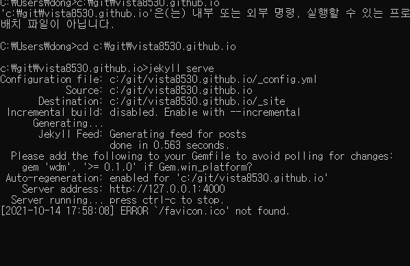

# 배우면서 정리하는 Active Directory 기초 개념 

## 목차

[1.포스팅 이유.](#포스팅-이유)

[2.Active Directory란](#한글만-되나)

[3.요롷게하내](#바뀌면안되내)

## 포스팅 이유

###  순서가 필요한 목록

1. 순서가 필요한 목록
    - 순서가 필요하지 않은 목록(서브)
    - 순서가 필요하지 않은 목록(서브) 
2. 순서가 필요한 목록
    1. 순서가 필요한 목록(서브)
    1. 순서가 필요한 목록(서브)
3. 순서가 필요한 목록

1.

2.

3.

4.

5.

## 한글만 되나

### 1.개념

으어어어ㅓ어어ㅓ어어ㅓㅇ 개빡이냐

1.
ㅈ

## 바뀌면안되내

